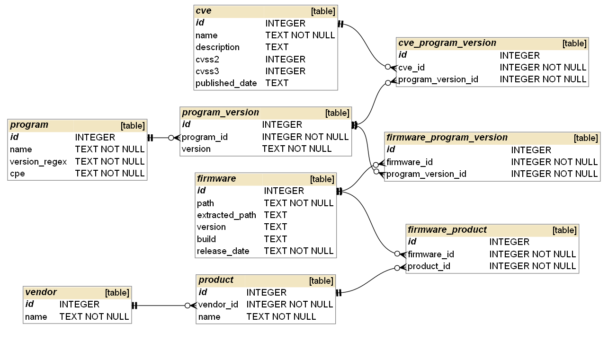

# Firmware known vulnerabilities

Tools used to find known vulnerabilities in firmware.

Note that this software is tailored to a specific workflow and is not created to be used outside of this workflow. But parts of the code can easily be reused for software requirering similar functionality.



## Scraper
This is a fork of the firmadyne scraper (https://github.com/firmadyne/scraper) with a patch applied which switches the database from PostgreSQL to SQLite (https://github.com/firmadyne/scraper/pull/9/commits/18b771548447d7113be059f2be28f73a45eb32de). The scraper scrapes firmware files from different websites.

All credits for this goes to the respective authors.

### Requirements
Install Miniconda: https://docs.conda.io/en/latest/miniconda.html
Install Scrapy: https://docs.scrapy.org/en/latest/intro/install.html

### How to run
From the miniconda command prompt run:
```
scrapy crawl --logfile output/dlink.log dlink
scrapy crawl --logfile output/linksys.log linksys
scrapy crawl --logfile output/tp-link_en.log tp-link_en
```

## Known vulnerability extractor
This tool can:
* Attempt to unpack the firmware downloaded by the scraper.
* Extract a list of software found in the firmware.
* Find known vulnerabilities for the software found.

All results are saved in a SQLite database. An entity relation diagram of the database can be seen on the top of the readme.

### Requirements
Only runs on Windows.
Install Docker: https://docs.docker.com/get-docker/
Install ripgrep: https://github.com/BurntSushi/ripgrep#installation
Install NVD Tools: https://github.com/facebookincubator/nvdtools#installation
Download NVD JSON data feeds and place them in ```nvdcve``` folder: https://nvd.nist.gov/vuln/data-feeds#JSON_FEED

### How to run
Change settings in the source code.

Import data from scraper:
```
python known_vulnerability_extractor.py --import-scraper <path to scraper database>
```

Unpack firmware:
```
python known_vulnerability_extractor.py --unpack <output folder>
```

Extract programs and find known vulnerabilities:
```
python known_vulnerability_extractor.py --programs
```

## File analyser
Analyses a folder and outputs the most common filenames, MIME types, libmagic identifications. It also outputs the most common filenames for files with one of the following MIME types: application/x-executable, application/x-sharedlib, text/x-shellscript and application/x-object. 

### Requirements
Install python-magic: https://github.com/ahupp/python-magic#installation

### How to run
```
python file_analyser.py <path_to_analyse>
```
